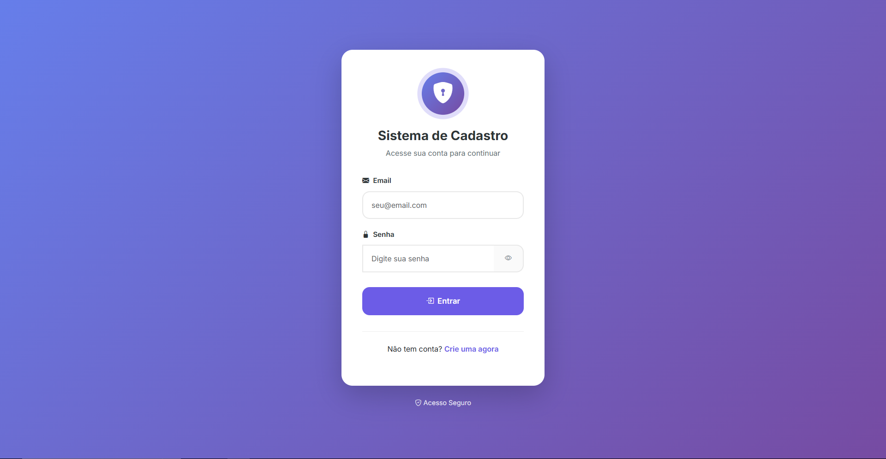
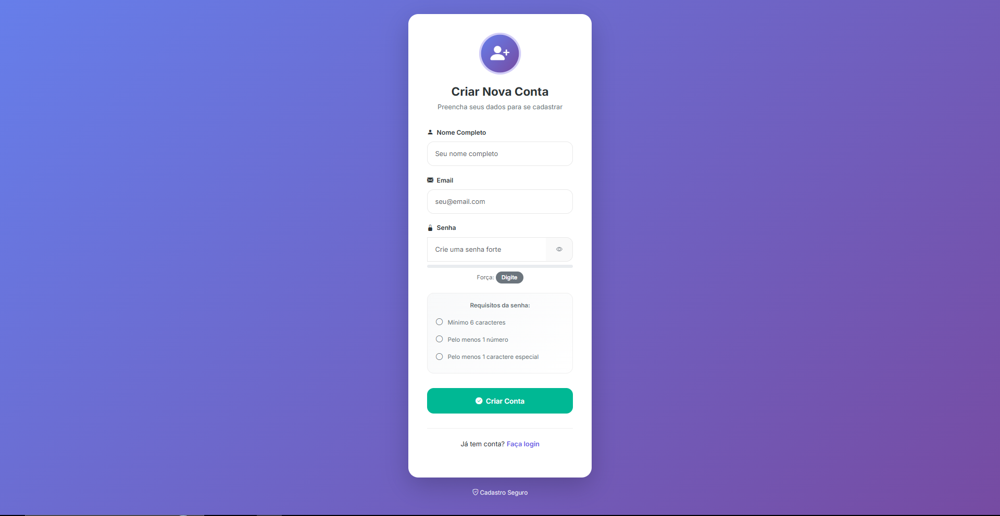

## Preview

### Tela inicial

### Dashboard

# Sistema de Usuários

Sistema web desenvolvido com Flask.

## Funcionalidades
- Cadastro de usuários
- Login com autenticação
- CRUD completo
- Banco de dados SQLite

## Tecnologias
- Python
- Flask
- SQLite
- HTML/CSS

